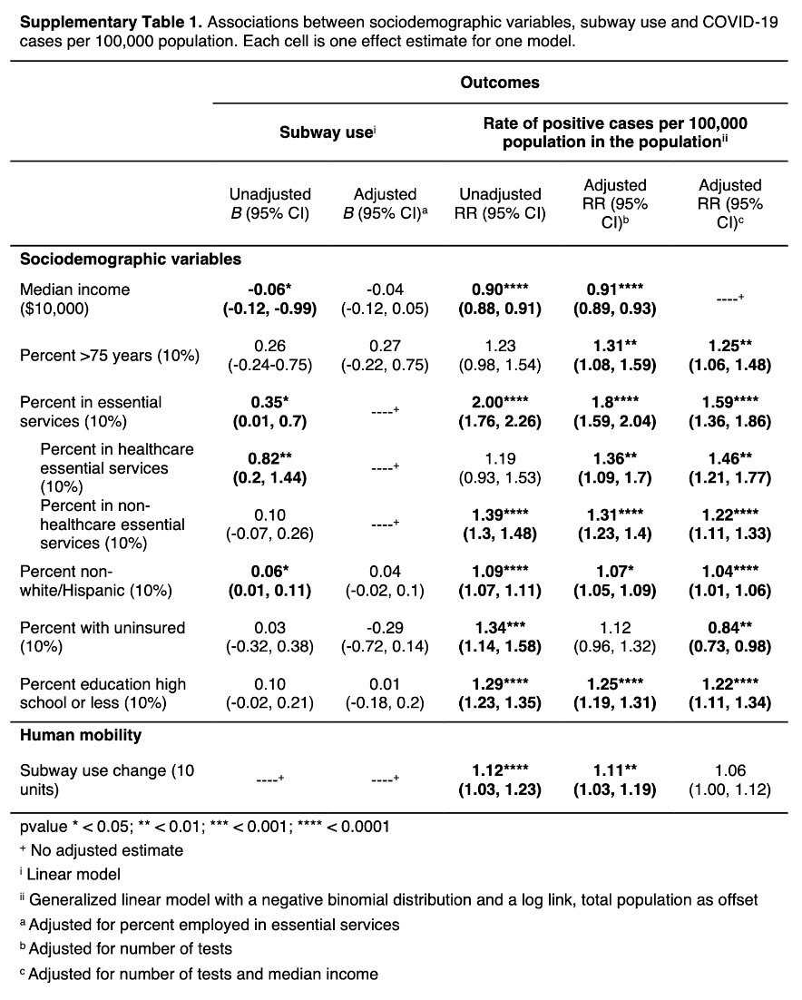
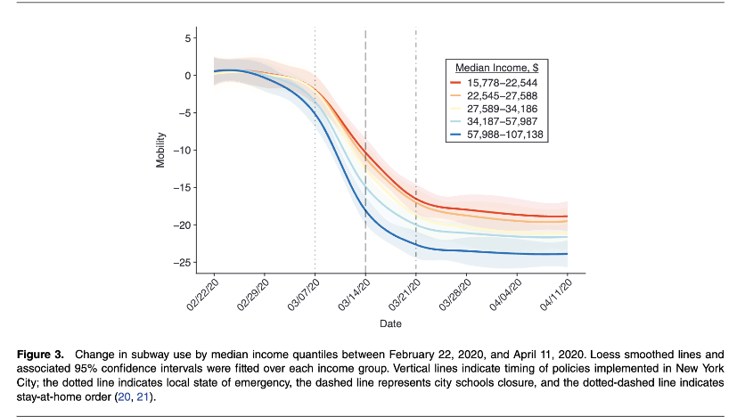
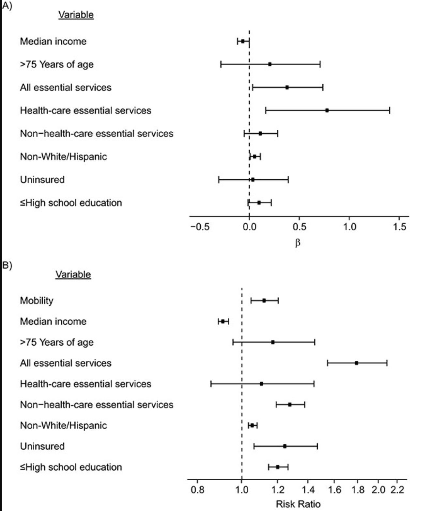

# Introduction
> I will be replicating a descriptive static, an inferential statistic, and a figure from the following paper: "Socioeconomic disparities in subway use and COVID-19 outcomes in New York City."  

- Article Citation: Karla Therese L Sy, Micaela E Martinez, Benjamin Rader, Laura F White, Socioeconomic Disparities in Subway Use and COVID-19 Outcomes in New York City, American Journal of Epidemiology, Volume 190, Issue 7, July 2021, Pages 1234–1242, https://doi.org/10.1093/aje/kwaa277
 
## Description of the Study
> The goal of the authors' research was to highlight how socioeconomic disparities in New York City were magnified during the COVID-19 pandemic during the onset of the stay-at-home mandaate. They looked at Subway data to assess mobility in different NYC boroughs  by looking at metro card swipes at different subway stations from January 2020 to April 2020 (Note: the lockdown began on March 15, 2020). While some residents chose to reduce their mobility on their own accord between January 2020 and April 2020, the authors found that 2 groups of residents remained mobile until the official lockdown in March. People of lower socioeconomic status who identified as non-White and people who were essential/health-care essential workers were more likely to continue using the Subway until the official lockdown mandate on March 15, 2020. This is a result of socioeconomic disparities, causing certain groups of people to continue going to work and putting their health at risk during the start of the COVID-19 pandemic. 

## Dataset Used
> Sy, Karla Therese L.; Martinez, Micaela E.; Rader, Benjamin; White, Laura F. (2021). Socioeconomic disparities in subway use and COVID-19 outcomes in New York City [Dataset]. Dryad. https://doi.org/10.5061/dryad.vhhmgqnrh

## Analyses Conducted
> The authors conducted a variety of analyses, including cross-sectional analyses, risk ratios, odds ratios, beta coefficients, 95% confidence intervals, regression, and segmented regression.
> I will be replicating Supplemental Table 1 for the descriptive statistic, Figure 4, and 95% confidence intervals for median income for the inferential statistic. 

## Getting Started: Load Packages
```{r, message=FALSE, warning=FALSE}
library(curl) # to connect & load data from github
library(ggplot2) # for data visualization
library(dplyr) # for data manipulation
library(segmented) # for regression models
```

# 1. Descriptive Statistics

> After multiple attempts at getting the same descriptive statistics from this paper, I have come to realize that the public data I downloaded/have access to from DRYAD for this paper does not include the *original* data to get the exact results in the table and other descriptive statistics they mention. With that said, I have used skills from **Module 4** to create a matrix of the data from Supplementary Table 1. 

## Descriptive Table

```{r}
tab <- matrix(c(-0.06, 0.26, 0.35, 0.82, 0.10, 0.06, 0.03, 0.10, -0.12, -0.24, 0.01, 0.2, -0.07, 0.01, -0.32, -0.02, -0.99, -0.75, 0.7, 1.44, 0.26, 0.11, 0.38, 0.21, 0.91, 1.31, 1.8, 1.36, 1.31, 1.07, 1.12, 1.25, 0.89, 1.08, 1.59, 1.09, 1.23, 1.05, 0.96, 1.19, 0.93, 1.59, 2.04, 1.7, 1.4, 1.09, 1.32, 1.31), ncol=6, byrow=FALSE)
colnames(tab) <- c('Unadjusted B', 'Beta 95% CI Lower Limit', 'Beta 95% CI Upper Limit', 'Adjusted RR', 'RR 95% CI Lower Limit', 'RR 95% CI Upper Limit')
rownames(tab) <- c('Median income', 'Percent > 75 years','Percent in essential services', 'percent in healthcare essential services', 'percent in non-healthcare essential services', 'percent non-white/Hispanic', 'Percent with uninsured', 'percent education high school or less')
tab <- as.table(tab)
print(tab)
```

## Reference Image
> Below, for reference, is Supplemental Table 1 from Sy (2020). I only replicated the top part of the table, "Sociodemographic variables". 



# 2. Inferential Statistics

## Import the Dataset
Please load the following datasets from my repository folder "Sy open data": 

- 1._Cross-sectional_COVID19_mobility_zcta.csv 
- 3._Longitudinal_Mobility_zcta_borough.csv

```{r}
# 1._Cross-sectional_COVID19_mobility_zcta.csv 
f <- curl("https://raw.githubusercontent.com/juliannad0929/julid24-data-replication-assignment/main/Sy%20open%20data/1._Cross-sectional_COVID19_mobility_zcta.csv")
d <- read.csv(f, header = TRUE)
head(d)

# 3._Longitudinal_Mobility_zcta_borough.csv
y <- curl("https://raw.githubusercontent.com/juliannad0929/julid24-data-replication-assignment/main/Sy%20open%20data/3._Longitudinal_Mobility_zcta_borough.csv")
x <- read.csv(y, header=TRUE)
head(x)
```


## 95% Confidence Interval for Median Income
```{r}
# First, we want to extract the values of the median incomes by zip code tabulation area (ZCTA)
nyc_med_income_zcta <- left_join(x, d[,c("ZCTA","median_income")], by=c("ZCTA"="ZCTA")) #left_join() keeps all observations in x

nyc_med_income_zcta_1 <- nyc_med_income_zcta %>% mutate(income_d = ntile(median_income, 5)) #mutate() creates new columns that are functions of existing variables

#To get the quantile minimum and maximum for each income group

quantile <- nyc_med_income_zcta_1 %>%
  group_by(income_d) %>%
  summarise(min=min(median_income,na.rm=TRUE), max=max(median_income,na.rm=TRUE))
quantile
```
## Reference Image
> Below, for reference, is Figure 3 from Sy (2020) from which I replicated the median income confidence intervals in the legend. 



# 3. Replicating Figure 4
> This figure assesses the association between sociodemographic variables, subway use, and COVID-19 rate per 100,0000 population. 

## Import the Dataset
Please download the following dataset from my repository folder "Sy open data": 5._Regression_output.csv

```{r}
r <- curl("https://raw.githubusercontent.com/juliannad0929/julid24-data-replication-assignment/main/Sy%20open%20data/5._Regression_output.csv")
reg <- read.csv(r, header=TRUE, stringsAsFactors = TRUE)
head(reg)
```


## Preparing the Data
> First, I'm going to rename the variables for the legend

```{r}
# Step 1: Factoring the variables from the dataset and making labels for the legend
reg$Variable <- factor(reg$Variable, levels = c("hs",
                                                "healthins",
                                                "minority",
                                                "essential",
                                                "health",
                                                "essential_both",
                                                "median_age",
                                                "Median_Income",
                                                "subway_use"),
                       labels = c("High school education",
                                  "Uninsured",
                                  "Non-White/Hispanic",
                                  "Non-health-care essential services",
                                  "Health-care essential services",
                                  "All essential services",
                                  ">75 Years of age",
                                  "Median income",
                                  "Mobility")) 
```

> Next, I want to separate the data by Outcome: "COVID-adjusted" and "Subway_Use"

```{r}
# Step 2: Separating the "Outcome" column into "COVID_adjusted" and "Subway_Use"
reg$Outcome <- factor(reg$Outcome, levels = c("COVID_adjusted","Subway_Use"),
                       labels = c("Rate of COVID-19 (per 100k)\n\nEstimate (adjusted for testing):\nRisk Ratio",
                                  "Mobility (10 Units)\n\nEstimate (unadjusted):\nbeta")) 

# Step 3: Making 2 separate data frames for each outcome.
mobil <- reg[1:8,] #rows 1-8 refers to Subway_Use, or mobility
RR <- reg[9:17,] #rows 9-17 refer to Covid_adjusted for the Risk Ratio

# Step 4: Establishing the intercepts 
mobil$intercept <- 0 #the null is 0
RR$intercept <- 1 #the null for risk ratio is 1
```

## Subway_Use Estimated Beta
> Then, we will make our figures for the estimated Beta for "Subway_Use" and the "COVID-adjusted" Risk Ratios.

```{r, echo=FALSE, message=FALSE, warning=FALSE, paged.print=FALSE}
fig4_1 <- ggplot(data=mobil, aes(x = Variable,y = RiskRatio, ymin = LowerLimit, ymax = UpperLimit )) +
  scale_y_continuous(limits=c(-.5,1.5), breaks = c(-.5,0,.5,1,1.5)) +
  geom_pointrange(cex=0.3) +
  geom_hline(data = mobil, aes(colour=Variable, yintercept = intercept), linetype=2, show.legend = FALSE) + xlab('') + 
  ylab(expression(beta)) + geom_errorbar(aes(ymin=LowerLimit, ymax=UpperLimit), width=0.3,cex=0.7) +
  theme_classic(base_size=12) +
  coord_flip() + theme(legend.position="bottom") + guides(col=guide_legend(ncol=3, byrow=TRUE, reverse = TRUE, title.position = "bottom")) + theme(legend.text = element_text(size=12), text=element_text(size=12), axis.text=element_text(size=12, colour="black"), legend.margin = margin(10, 50, 10, 10)
)

plot(fig4_1, fig.height=8, fig.width=8)
```

## Covid-Adjusted Risk Ratio
```{r, echo=FALSE, message=FALSE, warning=FALSE, paged.print-FALSE}
fig4_2 <- ggplot(data=RR, aes(x = Variable,y = RiskRatio, ymin = LowerLimit, ymax = UpperLimit )) +
  scale_y_continuous(trans = "log", limits=c(.8,2.2), breaks = c(.8,1,1.2,1.4,1.6,1.8, 2.0, 2.2)) +
  geom_pointrange(cex=0.3) +
  geom_hline(data = RR, aes(colour=Variable, yintercept = intercept), linetype=2, show.legend = FALSE) + xlab('') + 
  ylab("Risk Ratio") + geom_errorbar(aes(ymin=LowerLimit, ymax=UpperLimit),width=0.3,cex=0.7) +
  theme_classic(base_size=12) +
  coord_flip() + theme(legend.position="bottom") + guides(col=guide_legend(ncol=3, byrow=TRUE, reverse = TRUE, title.position = "bottom")) + theme(legend.text = element_text(size=12), text=element_text(size=12), axis.text=element_text(size=12, colour="black"), legend.margin = margin(10, 50, 10, 10)
)

plot(fig4_2, fig.height=8, fig.width=8)
```

## Reference Image

> Below, for reference, is Figure 4 from Sy (2020) that I replicated above. 



# Sources
> https://stulp.gmw.rug.nl/ggplotworkshop/comparinggroupstatistics.html#mean-errorbar-plots  
>
> https://stackoverflow.com/questions/14069629/how-can-i-plot-data-with-confidence-intervals  
>
> https://ggplot2.tidyverse.org/reference/geom_abline.html  
>
> https://rdocumentation.org/packages/ggplot2/versions/0.9.0/topics/geom_hline  
>
> https://cran.r-project.org/web/packages/segmented/segmented.pdf  
>
> https://dplyr.tidyverse.org/reference/mutate-joins.html 
>
> https://dplyr.tidyverse.org/reference/mutate.html
